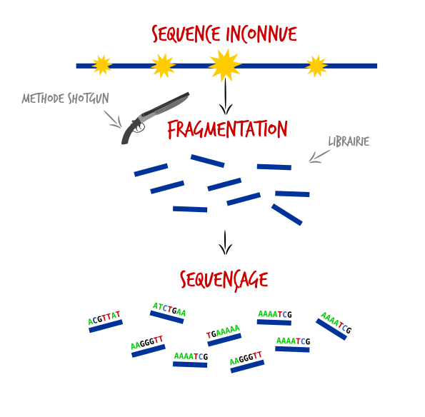
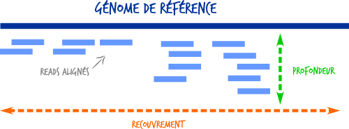
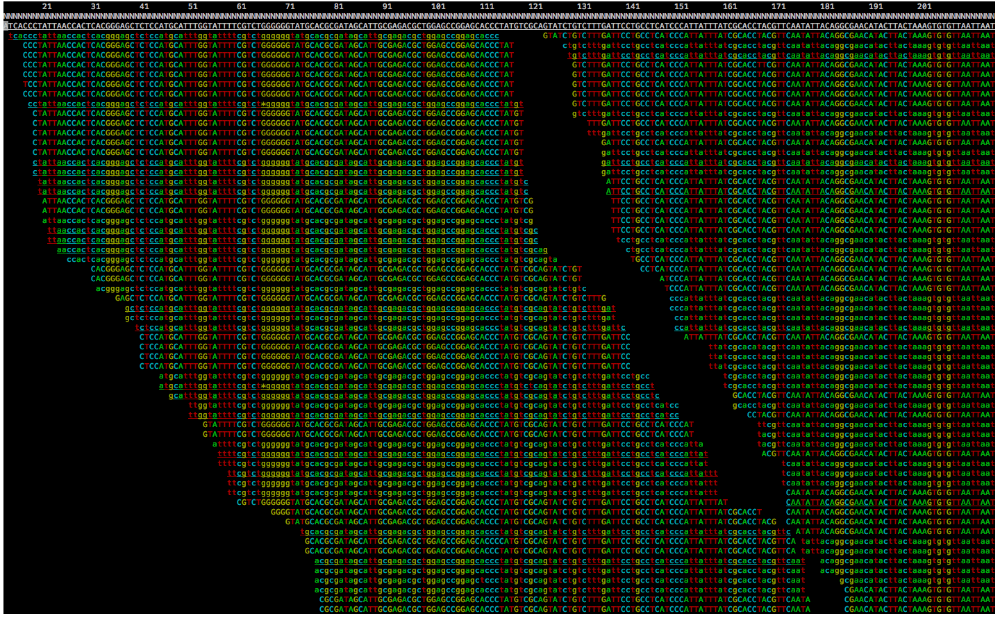
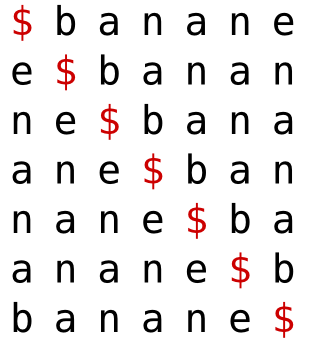
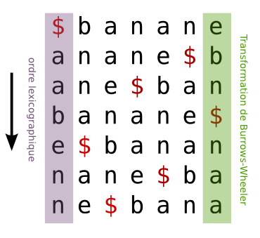

Séquençage haut débit et algorithme d'alignement
===

--- 

# Cas clinique 

Mr Dupond 34 ans

Découverte par coloscopie de 70 polypes intestinaux dans le cadre de rectorragies.
Le père et la grand-mère sont tous les deux décédés d'un cancer colorectal.
Vous suspectez un cause génétique et décider d'envoyer un tube de sang à Rennes pour le séquençage nouvelle générations (NGS) des principaux gènes associés aux cancers digestifs.

--- 
# Le séquençage de nouvelle génération 
 
## Séquençage d'un génome humain en 1990
- Coût : 3 milliards de dollars 
- Temps : 13 ans 
- Technologie : Sanger 
- Lis des fragments d'ADN de 800pb ➡ **x 40** 

## Séquençage d'un génome humain en 2015
- Coût : 800 dollars
- Temps : 3 jours
- Technologie : Illumina
- Lis des fragments d'ADN de 150pb ➡ **x 20 Millards**
---

--- 
# Exemple : La méthode shotgun

--- 
# Technologie de séquençage haut débit

- Illumina 
- Ion Torrent
- PacBio
- Oxford Nanopore

VIDEO

---

# Fichier de sortie -  Fastq
Fichier contenant les séquences de millions de reads 

  	@ID1
  	GATTTGGGGTTCAAAGCAGTATCGATCAAATAGTAAATCCATTTGTTC
  	+
  	!''*((((***+))%%%++)(%%%%).1***-+*''))**55CCF>>>
    @ID2
  	GTCGGGGTGGTATGTAGGTAAGGGAAAATAGTAAATCCATTTGTTC
  	+
  	!''*())%%%++)(%%%%).1***(((***+))%%%++)(%%%%).

---

# Alignement des reads sur un génome de référence

--- 

--- 
# Comment aligner les reads ?

### A vous de jouer
Trouver la positions des reads suivants sur un génome de référence 

	Genome de Référence 
    PANAMABANANA$
    123456789...

Reads 

	PANA
	BANA
	NAM
	ANA

---

# Alignement naïf 

	PANAMABANANA$
	PANA........   1
    
	PANAMABANANA$
    ......BANA     6
          
	PANAMABANANA$
    ..NAM          3

	PANAMABANANA$
	.ANA...ANAN..    2,7,9

#### Temps de calcul sur un génome humain
Très Très long 
car on doit tester du début jusqu'à la fin. Même si ca ne marche pas 

---

# Suffix Tree 
## Trouver la positions des reads sur un suffix tree

---

# Suffix Array 
## Decomposer le mot dans en tous les suffixes possibles 

---
# Suffix Array 
Reponse

Lourd de stocker tous les suffix. Pour un génome de réference, ca prendrait 3 milliards x 3 milliards environs ... 

---
# Transformé de Burrows-wheeler

   .............

---
# Transformé de Burrows-wheeler
## A vous de jouer 
Faite la transformé de Burrows wheeler du mot : x 
sans faire la matrix 

Faite l'inverse de la transformé de Burrows wheeler du mot : X

---

# Variant Calling 

Quel mutation retrouvé ? 

--- 

# Conclusion 
Chez le patient, on retrouve cette mutation. 

- Que faite vous ==> Etude familliale 
- Un mot sur l'éthique
- Un mot sur l'identito vigilience 
- Un mot d'accroche pour la suite 
	- Comment faire si on a pas de référence 
	- Comment nommer les mutations 
