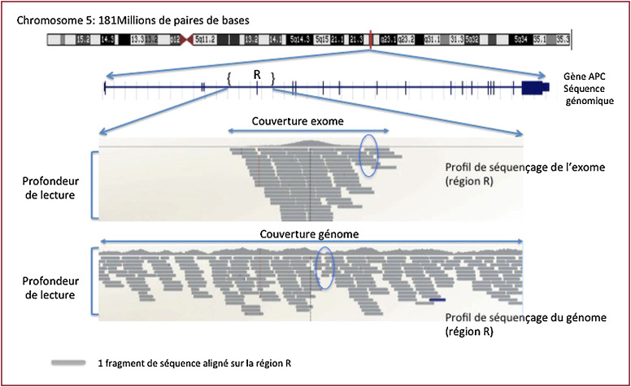
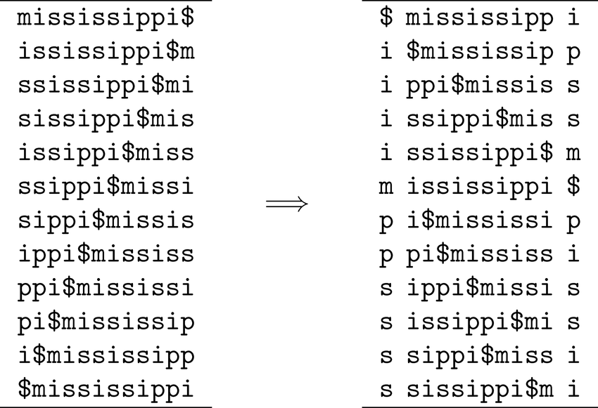
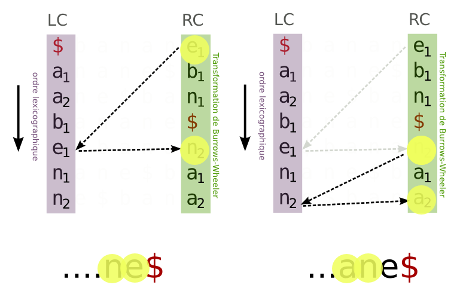
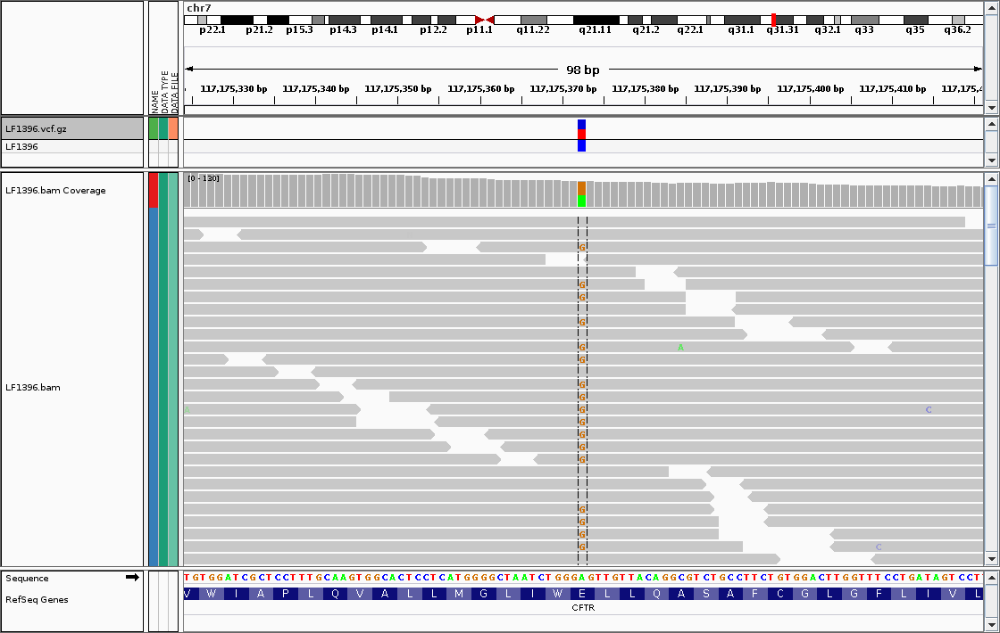

<!-- page_number: true -->

Séquençage haut débit et algorithme d'alignement
===

--- 

# Cas clinique 

Mr Dupond 34 ans

Découverte par coloscopie de 70 polypes intestinaux dans le cadre de rectorragies.
Le père et la grand-mère sont tous les deux décédés d'un cancer colorectal.
Vous suspectez une cause génétique et décider d'envoyer un tube de sang à Rennes pour le séquençage nouvelles générations (NGS) des principaux gènes associés aux cancers digestifs.

---
# Le séquençage de nouvelles générations (NGS ) 
## Séquençage d'un génome humain en 1990
- Coût : 3 milliards de dollars 
- Temps : 13 ans 
- Technologie : Sanger 
- Lis des fragments d'ADN de 800pb ➡ **x 40** 

## Séquençage d'un génome humain en 2015
- Coût : 800 dollars
- Temps : 3 jours
- Technologie : NGS 
- Lis des fragments d'ADN de 150pb ➡ **x 20 Millards**
---

--- 

# Le séquençage de nouvelles générations (NGS ) 

### Comment trouver le texte d'origine à partir des fragments ?
--- 
# 2 stratégies 

---

# Alignement sur une référence 

## Hg19.fa
- Construit à partir de plusieurs donneurs anonymes 
- contient ~3 milliards de nucléotides 
- Fichier de ~3 gigaoctets ( 1 base = 1 octet )

*Démo*

--- 

# Après séquençage 
## Fichier *Fastq*

Fichier pouvant contenir des milliards de fragments appelés **reads**

  	@ID1
  	GATTTGGGGTTCAAAGCAGTATCGATCAAATAGTAAATCCATTTGTTC
  	+
  	!''*((((***+))%%%++)(%%%%).1***-+*''))**55CCF>>>
    @ID2
  	GTCGGGGTGGTATGTAGGTAAGGGAAAATAGTAAATCCATTTGTTC
  	+
  	!''*())%%%++)(%%%%).1***(((***+))%%%++)(%%%%).
    
    
--- 
# Fichier après alignement 
## Fichier *Sam*/*Bam*
Contiens les reads et leurs positions sur le génome de référence.

	 
  	chr3	32423423	GATTTGGGGTTCAAAGCAGTATCGATCAAA
 	chr10	2132423		GTCGGGGTGGTATGTAGGTAAGGGAAAATA
    chr6	32423423	ACGTTTATATTAATAGCAGTATCACCAAAT
 	chr12	2132423		TGATAGACCCGTATGCGACTAAATTCGTAA
    chr6	32423423	ACGTTTATATTAATAGCAGTATCACCAAAT
 	chr12	2132423		TGATAGACCCGTATGCGACTAAATTCGTAA
    
	# Contenu du fichier simplifié

--- 

# Visualisation d'un fichier *Bam*

 

--- 
# Stratégie de séquençage 

Whole genom, Whole exome, Panel 

 

--- 
# Comment aligner les reads ?

### Exercice 1
Trouver la position des reads suivants sur un génome de référence 

	Génome de Référence 
    PANAMABANANA$
    123456789...

Reads 

	PANA
	BANA
	NAM
	ANA

---

# Alignement naïf 

	PANAMABANANA$
	PANA........   => position 1
    
	PANAMABANANA$
    ......BANA     => position 7
          
	PANAMABANANA$
    ..NAM          => position 3

	PANAMABANANA$
	.ANA...ANAN..  => positions 2,8 et 10
    
    
---

# Alignement naïf
## Temps de calcul 
Pour aligner la séquence **ATGGTAGTAGTACCGTAATA** sur le génome de référence hg19.fa, il faut environ 30 secondes*.

 

Combien de temps faudrait-il pour aligner 65 millions de reads ? 

	Okay, Google ....

---

# Alignement naïf
## Temps de calcul 
Pour aligner la séquence **ATGGTAGTAGTACCGTAATA** sur le génome de référence hg19.fa, il faut environ 30 secondes*.

 

Combien de temps faudrait-il pour aligner 65 millions de reads ? 

	61,793091 années

---

# Arbre des suffixes ( Suffix Tree )
La référence peut être décomposée pour construire [l'arbre des suffixes](https://fr.wikipedia.org/wiki/Arbre_des_suffixes).

### Exercice 2: Positions des mots **BANANAS, BANA, ANA** ?
<em style="font-size:29px"> Erratum : position + 1 </em>

---

# Liste des suffixes ( Suffix array )
### Exercice 3

- Trouver tous les suffixes du mot **PANAMABANANA$** 
- Associer à chaque suffixe sa position 
- Ordonnez-les par ordre alphabétique 
- Trouver *rapidement* les positions du mot **ANA**

---
# Liste des suffixes 

    13	$
    12	A$
    11	NA$
    10	ANA$
    9	NANA$
    8	ANANA$
    7	BANANA$
    6	ABANANA$
    5	MABANANA$
    4	AMABANANA$
    3	NAMABANANA$
    2	ANAMABANANA$
    1	PANAMABANANA$

---
# Liste des suffixes ordonnés

<pre>
13      $
12      A$
6       ABANANA$
4       AMABANANA$
10      <b>ANA$</b>
2       <b>ANAMABANANA$</b>
8       <b>ANANA$</b>
7       BANANA$
5       MABANANA$
11      NA$
3       NAMABANANA$
9       NANA$
1       PANAMABANANA$
</pre>

---

# Suffix Array 
## Temps de calcul : rapide ✔️
## Utilisation du disque dur : 
- Combien de suffixes avez-vous avec le génome de référence?
- Combien avez-vous de lettres sur l'ensemble du suffix array ?
- Quelle est la taille que prendrait ce fichier ? (1 base = 1 octet )

---

# Suffix Array 
## Utilisation du disque dur : 
- Combien de suffixes avez-vous avec le génome de référence?
	- II y a 3 milliards de suffixes
- Combien avez-vous de lettres sur l'ensemble du suffix array ?

		1 + 2 + 3 + 4 + 5 .... + 3 milliards  = 4.5e+18
        
$$\sum_{0}^{n} = \frac{n(n+1)}{2} $$

- Quelle est la taille que prendrait ce fichier ? (1 base = 1 octet )
	- 4'000'000 To soit 2 millions de disques durs de 2To. 

---
# Transformation de Burrows-wheeler

La transformation de Burrows-wheeler est une méthode permettant d'encoder et de décoder un texte.

&emsp;&emsp;&emsp;&emsp;

---

# Transformation de Burrows-wheeler
### Exercice 4

Faite la transformation de Burrows-wheeler du mot **PANAMABANANA$**

---

# Transformation de Burrows-wheeler

    # ROTATION                     # TRIE ALPHABÉTIQUE.
    PANAMABANANA$                  $PANAMABANANA
    ANAMABANANA$P                  A$PANAMABANAN
    NAMABANANA$PA                  ABANANA$PANAM
    AMABANANA$PAN                  AMABANANA$PAN
    MABANANA$PANA                  ANA$PANAMABAN
    ABANANA$PANAM                  ANAMABANANA$P
    BANANA$PANAMA                  ANANA$PANAMAB
    ANANA$PANAMAB                  BANANA$PANAMA
    NANA$PANAMABA                  MABANANA$PANA
    ANA$PANAMABAN                  NA$PANAMABANA
    NA$PANAMABANA                  NAMABANANA$PA
    A$PANAMABANAN                  NANA$PANAMABA
    $PANAMABANANA                  PANAMABANANA$
    
    
	Transformé: ANMNNPBAAAAA$
    
    
---

# Transformation de Burrows-wheeler

### ANMNNPBAAAAA$

La propriété de la transformation de Burrows-wheeler est de rassembler les mêmes lettres ensemble.

Permet de faire de la compression: **ANM2NPB5A$**

---
# Transformation de Burrows-wheeler
### Exercice 5
À partir du suffix array vu précédemment, retrouver directement la transformé de Burrows-wheeler ANMNNPBAAAAA$ 

	PANAMABANANA$

    13      $
    12      A$
    6       ABANANA$
    4       AMABANANA$
    10      ANA$
    2       ANAMABANANA$
    8       ANANA$
    7       BANANA$
    5       MABANANA$
    11      NA$
    3       NAMABANANA$
    9       NANA$
    1       PANAMABANANA$

---
# Transformation de Burrows-wheeler

À partir du suffix array vu précédemment, retrouver directement la transformé de Burrows-wheeler ANMNNPBAAAA<b style='color:red'>A</b>$ 

<pre>

PANAMABANAN<b style='color:red'>A</b>$

13      $
<b style='color:red'>12</b>      A$
6       ABANANA$
4       AMABANANA$
10      ANA$
2       ANAMABANANA$
8       ANANA$
7       BANANA$
5       MABANANA$
11      NA$
3       NAMABANANA$
9       NANA$
1       PANAMABANANA$
</pre>
 
---
# Transformation de Burrows-wheeler

À partir du suffix array vu précédemment, retrouver directement la transformé de Burrows-wheeler ANMNNPBAAA<b style='color:red'>AA</b>$ 

<pre>

PANAM<b style='color:red'>A</b>BANANA$

13      $
12      A$
<b style='color:red'>6</b>       ABANANA$
4       AMABANANA$
10      ANA$
2       ANAMABANANA$
8       ANANA$
7       BANANA$
5       MABANANA$
11      NA$
3       NAMABANANA$
9       NANA$
1       PANAMABANANA$
</pre>
 
---
# Transformation de Burrows-wheeler

À partir du suffix array vu précédemment, retrouver directement la transformé de Burrows-wheeler ANMNNPBAA<b style='color:red'>AAA</b>$ 

<pre>

PAN<b style='color:red'>A</b>MABANANA$

13      $
12      A$
6       ABANANA$
<b style='color:red'>4</b>       AMABANANA$
10      ANA$
2       ANAMABANANA$
8       ANANA$
7       BANANA$
5       MABANANA$
11      NA$
3       NAMABANANA$
9       NANA$
1       PANAMABANANA$
</pre>
 
---
# L'inverse de Burrows-wheeler
### Exercice 6
Quel est le mot à l'origine de la transformée suivante : 

 <h3>EBN$NAA</h3>

---
# L'inverse de Burrows-wheeler

Quel est le mot à l'origine de la transformé suivante : **BANANE$**

---
# Aligner à l'aide de Burrows-wheeler
### Exercice 7
À partir de la transformée et des positions , trouver ou s'aligne les mots suivants: 

- ANA
- AN

---

# Transformation de Burrows-wheeler
## Temps de calcul : rapide ✔️
## Utilisation du disque dur : Good ✔️ 
Il faut juste stocker la transformation de Burrows-wheeler ainsi que d'autres informations comme les positions.

### Cet algorithme est disponible via l'outil : BWA 

---

# Après l'alignement ... 
## Le variant calling 

--- 

# Conclusion 
Identification d'une mutation dans le gène APC : **g.112175246 A>G**

- Que faites-vous ? 
	- Confirmation de la mutation 
	- Surveillance rapprochée par coloscopie
	- Étude familiale avec consentement

--- 

# Référence

http://bioinformaticsalgorithms.com/

