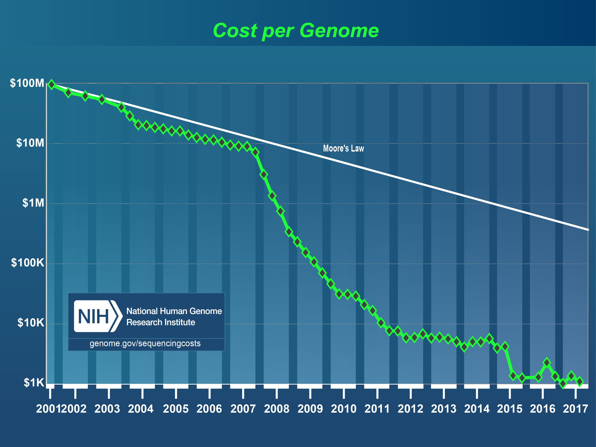
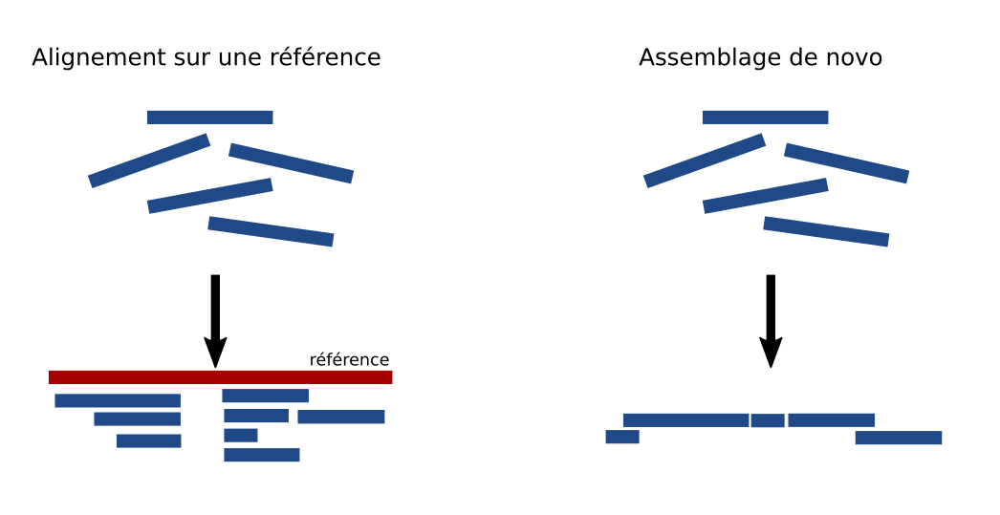
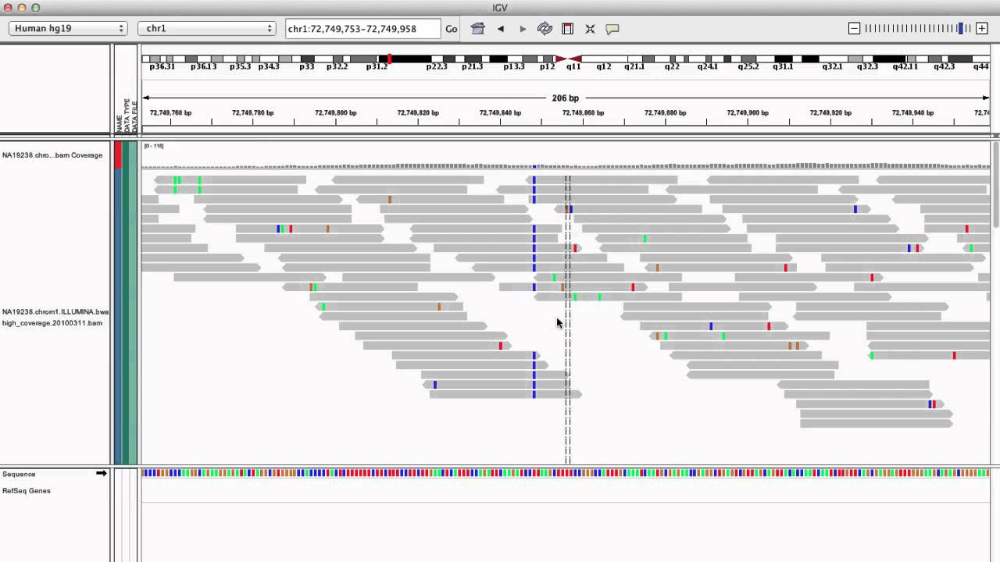
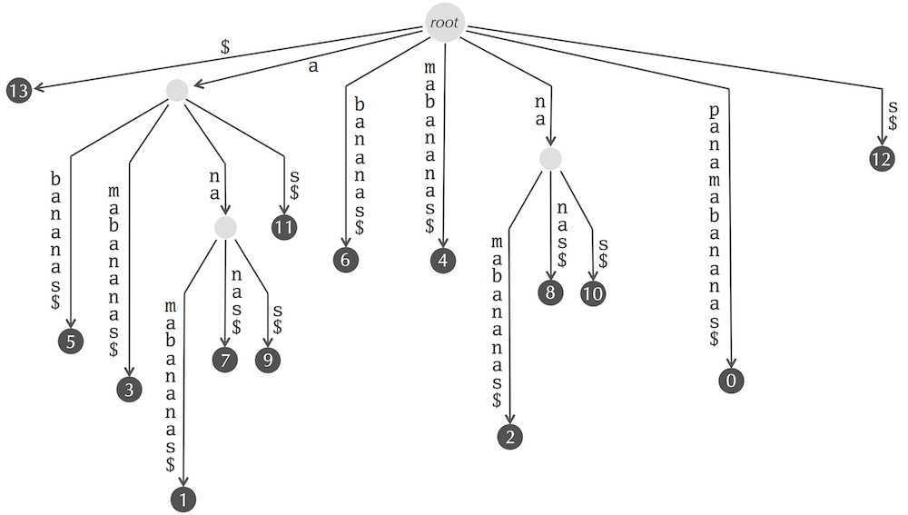

Séquençage haut débit et algorithme d'alignement
===

--- 

# Cas clinique 

Mr Dupond 34 ans

Découverte par coloscopie de 70 polypes intestinaux dans le cadre de rectorragies.
Le père et la grand-mère sont tous les deux décédés d'un cancer colorectal.
Vous suspectez un cause génétique et décider d'envoyer un tube de sang à Rennes pour le séquençage nouvelle générations (NGS) des principaux gènes associés aux cancers digestifs.

---
# Le séquençage de nouvelle générations (NGS ) 
## Séquençage d'un génome humain en 1990
- Coût : 3 milliards de dollars 
- Temps : 13 ans 
- Technologie : Sanger 
- Lis des fragments d'ADN de 800pb ➡ **x 40** 

## Séquençage d'un génome humain en 2015
- Coût : 800 dollars
- Temps : 3 jours
- Technologie : NGS 
- Lis des fragments d'ADN de 150pb ➡ **x 20 Millards**
---

--- 

# Le séquençage de nouvelle générations (NGS ) 

### Comment trouver le texte d'origine à partir des fragments ?
--- 
# 2 stratégies 

---

# Alignement sur une référence 

## Hg19.fa
- Construit à partir de plusieurs donneurs anonymes 
- contient ~3 milliards de nucléotides 
- Fichier de ~3 giga octets ( 1 base = 1 octet )

*Démo*

--- 

# Après séquençage 
## Fichier *Fastq*

Fichier pouvant contenir des milliards de fragments appelés **reads**

  	@ID1
  	GATTTGGGGTTCAAAGCAGTATCGATCAAATAGTAAATCCATTTGTTC
  	+
  	!''*((((***+))%%%++)(%%%%).1***-+*''))**55CCF>>>
    @ID2
  	GTCGGGGTGGTATGTAGGTAAGGGAAAATAGTAAATCCATTTGTTC
  	+
  	!''*())%%%++)(%%%%).1***(((***+))%%%++)(%%%%).
    
    
--- 
# Fichier après alignement 
## Fichier *Sam*/*Bam*
Contient les reads et leurs positions sur le génome de référence.

	 
  	chr3	32423423	GATTTGGGGTTCAAAGCAGTATCGATCAAA
 	chr10	2132423		GTCGGGGTGGTATGTAGGTAAGGGAAAATA
    chr6	32423423	ACGTTTATATTAATAGCAGTATCACCAAAT
 	chr12	2132423		TGATAGACCCGTATGCGACTAAATTCGTAA
    chr6	32423423	ACGTTTATATTAATAGCAGTATCACCAAAT
 	chr12	2132423		TGATAGACCCGTATGCGACTAAATTCGTAA
    
	# Contenu du fichier simplifié

--- 

# Visualisation d'un fichier *Bam*

 

--- 
# Comment aligner les reads ?

### A vous de jouer
Trouver la positions des reads suivants sur un génome de référence 

	Genome de Référence 
    PANAMABANANA$
    123456789...

Reads 

	PANA
	BANA
	NAM
	ANA

---

# Alignement naïf 

	PANAMABANANA$
	PANA........   => position 1
    
	PANAMABANANA$
    ......BANA     => position 6
          
	PANAMABANANA$
    ..NAM          => position 3

	PANAMABANANA$
	.ANA...ANAN..  => positions 2,8 et 10
    
    
---

# Alignement naïf
## Temps de calcul 
Pour aligner la séquence **ATGGTAGTAGTACCGTAATA** sur le génome de référence hg19.fa, il faut environ 30 secondes*.

 

Combien de temps faudrait-il pour aligner 65 millions de reads ? 

<em style="font-size:15px;position:absolute; top:500px"> * Intel(R) Core(TM) i5-3570K CPU @ 3.40GHz </em>

---

# Arbre des suffixes ( Suffix Tree )
La référence peut être décomposée en tous ses suffixes pour construire [l'arbre des suffixes](https://fr.wikipedia.org/wiki/Arbre_des_suffixes).

Quel est la position des mots **BANANAS, BANA et ANA** ?

---

# Liste des suffixes ( Suffix array )

- Trouver tous les suffixes du mot **PANAMABANANA$** 
- Associer à chaque suffixe sa position 
- Ordonnez les par ordre alphabétique 
- Trouver *rapidement* les positions du mot **ANA**

---
# Liste des suffixes 

    13	$
    12	A$
    11	NA$
    10	ANA$
    9	NANA$
    8	ANANA$
    7	BANANA$
    6	ABANANA$
    5	MABANANA$
    4	AMABANANA$
    3	NAMABANANA$
    2	ANAMABANANA$
    1	PANAMABANANA$

---
# Liste des suffixes ( alphabétique )

    13      $
    12      A$
    6       ABANANA$
    4       AMABANANA$
    10      ANA$
    2       ANAMABANANA$
    8       ANANA$
    7       BANANA$
    5       MABANANA$
    11      NA$
    3       NAMABANANA$
    9       NANA$
    1       PANAMABANANA$

---

# Suffix Array 
## Temps de calcul : Rapide ✔️
## Consommation sur le disque dur : 
- Combien de suffixes avez vous avec le génome de référence?
- Combien avez-vous de lettre sur l'ensemble du suffix array ?
- Quel est la taille que prendrait ce fichier ? (1 base = 1 octet )

---

# Suffix Array 
## Consommation sur le disque dur : 
- Combien de suffixes avez vous avec le génome de référence?

II y a 3 milliards de suffixes
- Combien avez-vous de lettres sur l'ensemble du suffix array ?

		1 + 2 + 3 + 4 + 5 .... + 3 milliards  = 4.5e+18
        
$$\sum_{0}^{n} = \frac{n(n+1)}{2} $$

- Quel est la taille que prendrait ce fichier ? (1 base = 1 octet )

4'000'000 To Soit 2 millions de disque dur de 2To. 

---
# Transformé de Burrows-wheeler

Faite la transformé de Burrows wheeler du mot : x 
sans faire la matrix 

Faite l'inverse de la transformé de Burrows wheeler du mot : X

---

# Variant Calling 

Quel mutation retrouvé ? 

--- 

# Conclusion 
Chez le patient, on retrouve cette mutation. 

- Que faite vous ==> Etude familliale 
- Un mot sur l'éthique
- Un mot sur l'identito vigilience 
- Un mot d'accroche pour la suite 
	- Comment faire si on a pas de référence 
	- Comment nommer les mutations 
